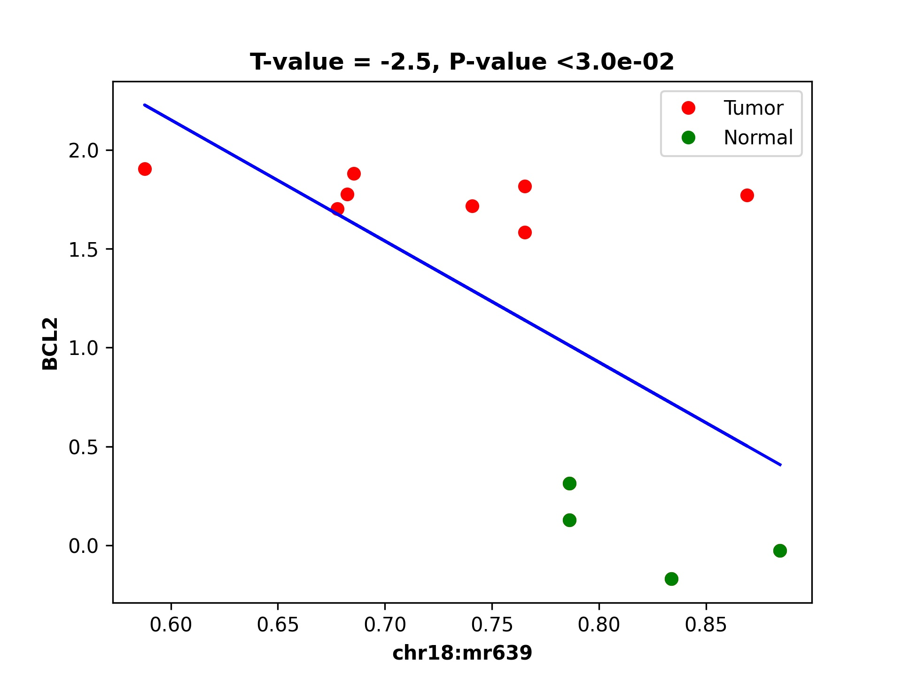
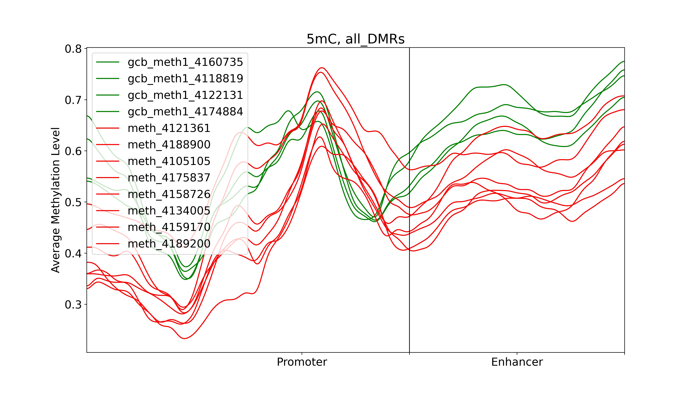

========
demoFLMR
========

This demo has five shell scripts. s1* should be run first, s2* should run second and so on for complete and correct run of the demo.

Step 0:
-------
Generate predefined genomic regions files based on gene Code annotation:

.. code-block:: bash

    OUT_FOLDER='../../data/fl_mr/in_data/in_genome_regions/'
    IN_FOLDER='../../data/fl_mr/in_data/gencode/'

    dmr_analysis dmr_gene_annotation -F ${OUT_FOLDER} -i no -l 10 \
        -rem no -xL 50000000 -X 10000 -Y 10000 -M 10000 -N 1000000 -hu yes -n no \
        -r ${IN_FOLDER}/gencode.v19.annotation_gene.refFlat \
        -g ${IN_FOLDER}/hg19.chrom.sizes.clear.sorted
    echo gene_annotation-DON

Please note that the script assumes certain file paths and data organization. Make sure to modify the paths according to your specific file structure and requirements. Also, remember to add the enhancer file manually in the `list_region_files.txt` file after running this script.

Here we assume

1. mutation blocks overlapping to enhancers and differential methylation regions are done (e.g., demo7 of bpb3 package)
2. and differential methylated regions (DMR) are already done by dmr_analysis

This script is similar to demo1 (e.g., integrated analysis of DEG, DMR, mutation blocks, and TAD - in paper https://pubmed.ncbi.nlm.nih.gov/35495111/)
But we only consider mutation blocks that are overlapping with enhancers and differential DNA methylation regions
The output folders: out_chromSegment, out_expression, out_genome, out_dds may need to be created manually!!

.. code-block:: bash

    #path of main folder to output data
    OUT_FOLDER='../../data/fl_mr/out_data/'
    # path of input data folder
    IN_FOLDER='../../data/fl_mr/in_data/'

    #Path of mutation blocks and block summary file exported by bpb3 package
    IN_BLOCKS=${IN_FOLDER}'/bpb3_demo7_mr_enhancers/out/mussd_blocks/'
    IN_BLOCK_SUMMARY='blocks_summary.tsv'

    #Path of mutation blocks with patient ID that will be exported by  dds_analysis find_block_patientID
    #IN_BLOCK_PATIENT=${IN_BLOCKS}'/blocks_summary_and_patientID2.tsv'

    #Other INPUT PATH and files et al
    #Convert bpb3 mutation blocks summary file to a bed format file with positions

    dds_analysis bpb3summary2bed_format --in_block_summary_file ${IN_BLOCKS}/$IN_BLOCK_SUMMARY
    echo  ${IN_BLOCKS}'/'${IN_BLOCK_SUMMARY}
    echo "preprocess_data - Done"

    replace='_block_position.bed'
    finds='.tsv'
    IN_BLOCK_FILE=${IN_BLOCK_SUMMARY//$finds/$replace}

    #Input path of a list of predefined genomic regions that will be used to map mutation blocks, and DMRs.
    IN_GENOME_REGIONS=${IN_FOLDER}'/in_genome_regions/'
    IN_LIST_REGIONS='list_region_files.txt_gencode'
    IN_GENOME_refFlat=${IN_GENOME_REGIONS}'/data/gencode.v19.annotation_gene.ref_clean_sorted.bed'

    #path of genome lib information files such as TAD,  chromatin segment, and genome files et al
    IN_GENOME_LIB='../../data/'
    #path of chromatin segment files that will be used to intersect with mutation blocks
    IN_CHROMSEG=${IN_GENOME_LIB}'/chromSegment/hg19/'

    #path of TAD information that will be used to map mutation blocks
    IN_TAD=${IN_GENOME_LIB}'/in_tad/'
    #path to common TAD positions across 5 human cell lines
    IN_TAD_INFO=${IN_TAD}'/Table4_TAD_annotations_sorted_chr.bed'
    #path to common TAD boundary position among 5 human cell lines
    IN_TAD_BOUNDARY=${IN_TAD}'/Table1_common_boundaries_merged_sorted_chr.bed'

    #path to gene positions in sorted bed format which is generated by s1_run_annotation.sh
    IN_GENE_POSITION=${IN_GENOME_REGIONS}'data/gene_Up1_Down1removedShort.bed'

    #Path of differentially methylated regions, differentially expressed genes, and output folder for mutation blocks mapped to predefined genomic regions.
    #Input path to DMRs/MRs predicted and ranked by dmr_analysis
    IN_DMR=${IN_FOLDER}'/DMR_CpG_context/2_chroms_all_mr_data_range_dmrRanking.bed'

    #path to DEG genes exported from bpb3 package
    IN_EXPRESS=${IN_FOLDER}'/in_DEG/differentially_expressed_genes_nonfolder.txt'

    #add N bp flank region on the two sides of mutation blocks before intersecting them to DMRs
    FLANK_BP=0

    #OUTPUT PATH
    #path for exporting mutation blocks mapped to predefined genomic regions
    OUT_GENOME=${OUT_FOLDER}'/out_genome/'
    #path for exporting mutation blocks mapped to chromatin segmentations
    OUT_CHROMSEG=${OUT_FOLDER}'/out_chromSegment/'
    #path for exported mutation blocks associated with DEGs
    OUT_EXPRESS=${OUT_FOLDER}'/out_expression/'
    #path for final results
    OUT_FINAL=${OUT_FOLDER}/'out_DmrDeg2block'

Block summary input file is following:

.. code-block:: bash

    block_id	chrom	start_pos	end_pos	number_of_mutations	number_of_patients	mutation_distribution	region_names
    block_2_18_60987833_60988552	18	60987808	60988576	118	9	35,21,13,8,11,9,8,5,8	chr18:mr22253:hypo:D
    block_1_18_60984827_60987028	18	60984802	60987052	160	9	24,32,10,22,5,22,24,6,15	chr18:mr22251:hyper:D,chr18:mr22252:hypo:D,chr18:mr22253:hypo:D
    block_0_18_60983893_60984144	18	60983868	60984168	22	4	8,4,9,1	chr18:mr22250:hyper:D,chr18:mr22251:hyper:D,chr18:mr22252:hypo:D,chr18:mr22253:hypo:D

DMR file:
2_chroms_all_mr_data_range_dmrRanking.bed

.. code-block:: bash

    chr18	57001634	57003436	chr18:mr0:mix:U	0.1308206406073999
    chr18	57005127	57007836	chr18:mr1:mix:U	0.0674646718818239
    chr18	57012900	57015233	chr18:mr2:mix:U	0.08007764185618908
    chr18	57017008	57018986	chr18:mr3:hypo:U	0.0020920250443539944
    chr18	57019993	57020668	chr18:mr4:mix:U	0.3942126190276321
    chr18	57022124	57027729	chr18:mr5:hypo:D	0.9998645092181799
    chr18	57028952	57030829	chr18:mr6:hypo:D	0.9999113822308282
    chr18	57033570	57042036	chr18:mr7:mix:U	0.16519832525306027
    chr18	57043738	57045135	chr18:mr8:mix:D	0.9931967885078828
    chr18	57046285	57065804	chr18:mr9:mix:U	0.1181969538449906
    chr18	57066825	57071330	chr18:mr10:mix:U	0.09771325259636
    chr18	57076353	57080279	chr18:mr11:hypo:D	0.9999480400136458

Head of the TAD boundaries
Table1_common_boundaries_merged_sorted_chr.bed

.. code-block:: bash

    chr1	1200000	1275000	1	75000
    chr1	3700000	3775000	1	75000
    chr1	5925000	6000000	1	75000
    chr1	6475000	6550000	1	75000
    chr1	7900000	7975000	1	75000
    chr1	8350000	8425000	1	75000
    chr1	8875000	8950000	1	75000
    chr1	9550000	9625000	1	75000
    chr1	10450000	10525000	1	75000
    chr1	10975000	11050000	1	75000
    chr1	12050000	12125000	1	75000

Step 1:
_______
Map mutation block to predefined genomic regions

.. code-block:: bash

    dds_analysis map_block2genome --in_sortedBlock_file $IN_BLOCK_FILE  \
            --in_genomeRegion_file $IN_LIST_REGIONS \
            --in_referenceGenome_file $IN_GENOME_refFlat \
            --out_file_folder $OUT_GENOME --is_MR_or_Blocks 1
    echo map_block2genome - Done
    echo ""
    #read  -n 1 -p "Click for continuing 1 :"
    echo ""

Step 2:
_______
Map mutation block to chromSegment, here assume all input mutation block has the same input file as the map_block2genome

.. code-block:: bash

    dds_analysis map_block2chromSegment --in_sortedBlock_file $IN_BLOCK_FILE \
            --in_chromSegment_folder $IN_CHROMSEG \
            --out_file_folder $OUT_CHROMSEG --is_MR_or_Blocks 1
    echo map_block2chromSegment - Done
    echo ""
    #read  -n 1 -p "Click for continuing 2 :"
    echo ""

Step 3:
-------
Map mutation blocks to DMR after adding flank regions to two-sides of blocks if it is needed

.. code-block:: bash

    dds_analysis map_block2dmr --in_sortedBlock_file $IN_BLOCK_FILE \
            --in_dmr_file $IN_DMR \
            --in_flank_region2block $FLANK_BP --out_file_folder $OUT_FOLDER
    echo map_block2dmr - Done
    echo ""
    #if the file name is known then skip this
    read -p "Enter exported map_block2dmr file name with full path for continuing 3: "  IN_BLOCK_DMR
    echo ""
    echo "IN_BLOCK_DMR: $IN_BLOCK_DMR "
    echo ""

Step 4:
-------
Combine genomic regions with block information and find their associated differential expressed genes

.. code-block:: bash

    dds_analysis find_geneExp4block --in_blocks_genome_folder $OUT_GENOME \
            --in_sortedBlock_file $IN_BLOCK_FILE \
            --in_deg_file $IN_EXPRESS \
            --in_feature_list 'TSS,gene,TES,5dist,enhancers' \
            --out_file_folder $OUT_EXPRESS
    echo find_geneExp4block - Done

    #read  -n 1 -p "Click for continuing 4 :"

Step 5:
-------
Find patient IDs for each mutation block, this step can be slow if the number of blocks is large! but only run once for block summary from BB2

.. code-block:: bash

    dds_analysis find_block_patientID \
        --in_block_summary_file ${IN_BLOCKS}/$IN_BLOCK_SUMMARY  \
        --in_block_folder $IN_BLOCKS
    echo find_block_patientID - Done
    echo ""
    #if file name is known then skip this line
    #read -p "Enter exported patient ID file name with full path for continuing 4: "  IN_BLOCK_PATIENT
    echo ""
    IN_BLOCK_PATIENT=${IN_BLOCKS}'/blocks_summary_and_patientID2.tsv'
    echo "IN_BLOCK_PATIENT: $IN_BLOCK_PATIENT "
    echo ""

    #read  -n 1 -p "Click for continuing 5 :"
    echo ""

    #This file exported from earlier step: map_block2dmr
    #this file name need be manually input
    #IN_BLOCK_DMR='blocks_summary_block_position_0flank_0.7Proba_2blocks_2blocks2mr_2blocks2dmr'

Step 6:
-------
Combine DMR, DEG and block information together

.. code-block:: bash

    dds_analysis combine_dmr_deg2block --in_sortedBlock_patient_file $IN_BLOCK_PATIENT \
        --in_dmr_file  ${IN_BLOCK_DMR} \
            --in_deg_folder_and_file_suffix ${OUT_EXPRESS}'/*.tsv' \
        --out_file_folder $OUT_FINAL
    echo combine_dmr_deg2block - Done

    finds='.tsv'
    replace=''
    FULL_PATH_IN_BLOCK_DMR=${IN_BLOCK_DMR//$finds/$replace}
    IN_BLOCK_DMR_NAME=$(basename  "$FULL_PATH_IN_BLOCK_DMR")
    echo $IN_BLOCK_DMR_NAME

blocks_summary_block_position_0flank_0.6Proba_3blocks_2blocks2mr_2blocks2dmr_deg_info_filtered_DMR_or_DEG_uniqGene_commonTAD_Boundary.tsv:

.. code-block:: bash

    gene_name	patients	gene_type	block_id	new_mr_sites	patient_id	enhancers	TAD2gene	Boundary2gene	TAD2block	Boundary2block	isTAD
    BCL2	9	TSS	block_2_18_60987833_60988552	chr18:mr621	patient_0,patient_2,patient_3,patient_4,patient_5,patient_7,patient_8,patient_9,patient_10	nan	18:60675000:61075000:Low-active	na	18:60675000:61075000:Low-active	na	1.0
    BCL2	9	TSS	block_1_18_60984827_60987028	chr18:mr621	patient_0,patient_2,patient_3,patient_4,patient_5,patient_7,patient_8,patient_9,patient_10	enhancer	18:60675000:61075000:Low-active	na	18:60675000:61075000:Low-active	na	1.0
    BCL2	4	TSS	block_0_18_60983893_60984144	nan	patient_0,patient_3,patient_4,patient_7	enhancer	18:60675000:61075000:Low-active	na	18:60675000:61075000:Low-active	na	1.0
    KDSR	9	TES	block_2_18_60987833_60988552	chr18:mr621	patient_0,patient_2,patient_3,patient_4,patient_5,patient_7,patient_8,patient_9,patient_10	nan	18:60675000:61075000:Low-active	na	18:60675000:61075000:Low-active	na	1.0
    KDSR	9	TES	block_1_18_60984827_60987028	chr18:mr621	patient_0,patient_2,patient_3,patient_4,patient_5,patient_7,patient_8,patient_9,patient_10	enhancer	18:60675000:61075000:Low-active	na	18:60675000:61075000:Low-active	na	1.0
    SERPINB5	9	5dist	block_2_18_60987833_60988552	chr18:mr621	patient_0,patient_2,patient_3,patient_4,patient_5,patient_7,patient_8,patient_9,patient_10	nan	18:61150000:61575000:Low	18:61075000:61150000:1	18:60675000:61075000:Low-active	na	0.0
    HMSD	9	5dist	block_2_18_60987833_60988552	chr18:mr621	patient_0,patient_2,patient_3,patient_4,patient_5,patient_7,patient_8,patient_9,patient_10	nan	na	18:61575000:61650000:1	18:60675000:61075000:Low-active	na	0.0

Step 7:
-------
Filter blocks based DMR or DEG information

.. code-block:: bash

    dds_analysis filter_blocks --in_combined_DmrDegBlock_file $OUT_FINAL/${IN_BLOCK_DMR_NAME}_deg_info.tsv
    echo filter_blocks - Done
    #read -n 1 -p "Click for continuing 7: "

Step 8:
-------
Collect unique genes name from predicted blocks with DMR and DEG

.. code-block:: bash

    dds_analysis collect_gene_names4blocks --in_filtered_blockGene_file $OUT_FINAL/${IN_BLOCK_DMR_NAME}_deg_info_filtered_DMR_and_DEG.tsv
    dds_analysis collect_gene_names4blocks --in_filtered_blockGene_file $OUT_FINAL/${IN_BLOCK_DMR_NAME}_deg_info_filtered_DMR_or_DEG.tsv
    echo collect_gene_names2blocks - Done

blocks_summary_block_position_0flank_0.6Proba_3blocks_2blocks2mr_2blocks2dmr_deg_info_filtered_DMR_and_DEG.tsv

.. code-block:: bash

    block_id	chrom	start_pos	end_pos	number_of_mutations	number_of_patients	mutation_distribution	patient_id	new_mr_sites	mr_logReg_proba	filtered_TSS	filtered_deg_p_value2TSS	filtered_TES	filtered_deg_p_value2TES	filtered_5dist	filtered_deg_p_value25dist	enhancers	deg_p_value2enhancers
    block_2_18_60987833_60988552	18	60987808	60988576	118	9	35,21,13,8,11,9,8,5,8	patient_0,patient_2,patient_3,patient_4,patient_5,patient_7,patient_8,patient_9,patient_10	chr18:mr621	0.624000054239737	BCL2	1.4739795539267432e-09	KDSR	2.253337153854709e-06	SERPINB5,HMSD	0.0188981284877041,1.3204080353838545e-07
    block_1_18_60984827_60987028	18	60984802	60987052	160	9	24,32,10,22,5,22,24,6,15	patient_0,patient_2,patient_3,patient_4,patient_5,patient_7,patient_8,patient_9,patient_10	chr18:mr621	0.624000054239737	BCL2	1.4739795539267432e-09	KDSR	2.253337153854709e-06			enhancer ,enhancer	nan,nan

blocks_summary_block_position_0flank_0.6Proba_3blocks_2blocks2mr_2blocks2dmr_deg_info_filtered_DMR_or_DEG

.. code-block:: bash

    block_id	chrom	start_pos	end_pos	number_of_mutations	number_of_patients	mutation_distribution	patient_id	new_mr_sites	mr_logReg_proba	filtered_TSS	filtered_deg_p_value2TSS	filtered_TES	filtered_deg_p_value2TES	filtered_5dist	filtered_deg_p_value25dist	enhancers	deg_p_value2enhancers
    block_2_18_60987833_60988552	18	60987808	60988576	118	9	35,21,13,8,11,9,8,5,8	patient_0,patient_2,patient_3,patient_4,patient_5,patient_7,patient_8,patient_9,patient_10	chr18:mr621	0.624000054239737	BCL2	1.4739795539267432e-09	KDSR	2.253337153854709e-06	SERPINB5,HMSD	0.0188981284877041,1.3204080353838545e-07
    block_1_18_60984827_60987028	18	60984802	60987052	160	9	24,32,10,22,5,22,24,6,15	patient_0,patient_2,patient_3,patient_4,patient_5,patient_7,patient_8,patient_9,patient_10	chr18:mr621	0.624000054239737	BCL2	1.4739795539267432e-09	KDSR	2.253337153854709e-06			enhancer ,enhancer	nan,nan
    block_0_18_60983893_60984144	18	60983868	60984168	22	4	8,4,9,1	patient_0,patient_3,patient_4,patient_7			BCL2	1.4739795539267432e-09					enhancer

If no TAD information available then we can skip below two lines of check_block_gene_inTAD but use the exported file from collect_gene_names4blocks for step 10 gene ranking !!

Step 9:
-------
Check whether the block/gene/ in the same TAD or boundary

.. code-block:: bash

    dds_analysis check_block_gene_inTAD --in_filtered_blockUqGene_file $OUT_FINAL/${IN_BLOCK_DMR_NAME}_deg_info_filtered_DMR_and_DEG_uniqGene.tsv \
            --in_gene_position_file ${IN_GENE_POSITION} \
            --in_TAD_position_file ${IN_TAD_INFO}  \
            --in_TAD_boundary_file ${IN_TAD_BOUNDARY}
    echo check_block_gene_inTAD - Done for DMR and DEG

    dds_analysis check_block_gene_inTAD --in_filtered_blockUqGene_file $OUT_FINAL/${IN_BLOCK_DMR_NAME}_deg_info_filtered_DMR_or_DEG_uniqGene.tsv \
            --in_gene_position_file ${IN_GENE_POSITION} \
            --in_TAD_position_file ${IN_TAD_INFO} \
            --in_TAD_boundary_file ${IN_TAD_BOUNDARY}
    echo check_block_gene_inTAD - Done for DMR or DEG

Step 10:
--------
Rank gene list

Here tss=4, tes=enhancer=gene=2, 5dist=1
If there is not a TAD information available for the filtering, then we can use  $OUT_FINAL/${IN_BLOCK_DMR_NAME}_deg_info_filtered_DMR_or_DEG_uniqGene.tsv as input for unique_gene_file

.. code-block:: bash

    dds_analysis dds_geneRanking --in_unique_gene_file $OUT_FINAL/${IN_BLOCK_DMR_NAME}_deg_info_filtered_DMR_or_DEG_uniqGene_commonTAD_Boundary_list2UqGene.tsv \
           --in_DEG_file ${IN_EXPRESS} \
           --in_DMR_file ${IN_DMR} -inCutoff 0.5
    echo geneRanking - Done

blocks_summary_block_position_0flank_0.6Proba_3blocks_2blocks2mr_2blocks2dmr_deg_info_filtered_DMR_or_DEG_uniqGene_commonTAD_Boundary_list2UqGene.tsv

.. code-block:: bash

    gene_name	gene_type	block_id	new_mr_sites	patients	isTAD	enhancers	patient_id
    BCL2	TSS~TSS~TSS	block_2_18_60987833_60988552~block_1_18_60984827_60987028~block_0_18_60983893_60984144	chr18:mr621~chr18:mr621~nan	9~9~4	1.0~1.0~1.0	nan~enhancer~enhancer	patient_0,patient_2,patient_3,patient_4,patient_5,patient_7,patient_8,patient_9,patient_10~patient_0,patient_2,patient_3,patient_4,patient_5,patient_7,patient_8,patient_9,patient_10~patient_0,patient_3,patient_4,patient_7
    KDSR	TES~TES	block_2_18_60987833_60988552~block_1_18_60984827_60987028	chr18:mr621~chr18:mr621	9~9	1.0~1.0	nan~enhancer	patient_0,patient_2,patient_3,patient_4,patient_5,patient_7,patient_8,patient_9,patient_10~patient_0,patient_2,patient_3,patient_4,patient_5,patient_7,patient_8,patient_9,patient_10

Step 11:
--------
Find enhancer target genes

.. code-block:: bash

    echo " For results geneRanking in out_DmrDeg2block (either DMR_and_DEG or DMR_or_DEG"
    #if file name is known then skip this line
    #read -p "Enter dds_geneRanking exported blocks_summary_block_position_* file with full path for continuing : "  IN_GENE2BLOCK
    IN_GENE2BLOCK='_deg_info_filtered_DMR_or_DEG_uniqGene_commonTAD_Boundary_list2UqGene.tsv'

    finds='.tsv'
    replace='_selectedGenes_gt_0.5.txt'
    IN_GENE2BLOCK=${IN_GENE2BLOCK//$finds/$replace}
    IN_GENE2BLOCK=$OUT_FINAL/${IN_BLOCK_DMR_NAME}${IN_GENE2BLOCK}

    echo "IN_GENE2BLOCK: $IN_GENE2BLOCK "
    SELECTED_GENE='BCL2'

    dds_analysis find_enhancer_target_genes --in_enhancer_file_folder ${IN_FOLDER}/in_enhancer/hg19_enhancer2gene_bed \
        --in_DDS_file ${IN_GENE2BLOCK} \
        --in_selected_gene ${SELECTED_GENE} --out_folder ${OUT_FOLDER}/out_enhancers

    echo find_enhancer_target_genes - Done - ${SELECTED_GENE}

BCL2_blocks_sorted.bed :

.. code-block:: bash

    chr18	60983893	60984144	block_0_18_60983893_60984144	nan	TSS	4	enhancer
    chr18	60984827	60987028	block_1_18_60984827_60987028	chr18:mr621	TSS	9	enhancer

Preprocess for next analysis:
-----------------------------

Before running following steps, it assumes that DMRs are already predicted by dmr_analysis

The script is used to prepare files for dds_analysis dTarget_methy_vs_express

A description of parameters:

in_folder:	is path of DMRs mapped to genome
in_string:	string in exported file
in_tss_file_mr:	DMRs mapped to TSS regions
in_dist_file:		DMRs mapped to 5distance regions
in_deg_file:		differential expression file (bpb3 output format)
out_folder:		output file path
tss_file:		a predefined TSS regions for further analysis
full_mr_file:		a list of all ranked dmr from dmr_analysis
in_genome_file:		a bed formatted enhancer position file
gene_col_name:		column name of gene ID/name

.. code-block:: bash

    dds_analysis preprocess \
          -in_folder  '../../data/fl_mr/out_data/out_map2genome/' \
          -in_string '_fl' \
          -in_tss_file_mr '../../data/fl_mr/out_data/out_map2genome/2_chroms_all_mr_data_range_dmrRanking_TSS_Up10000_Down10000_overlap1e-09.bed' \
          -in_dist_file '../../data/fl_mr/out_data/out_map2genome/2_chroms_all_mr_data_range_dmrRanking_noGenes_5dist_Up1000000_Up10000_overlap1e-09.bed' \
          -in_deg_file '../../data/fl_mr/in_data/in_DEG/differentially_expressed_genes_nonfolder.txt' \
          -out_folder '../../data/fl_mr/out_data/' \
          -tss_file '../../data/fl_mr/in_data/in_genome_regions/data/TSS_Up10000_Down10000.bed' \
          -full_mr_file '../../data/fl_mr/in_data/DMR_CpG_context/2_chroms_all_mr_data_range_dmrRanking.bed' \
          -in_genome_file '../../data/fl_mr/in_data/in_genome_regions/data/hg19_all_enhancers_merged_4dmr.bed' \
          -gene_col_name '#gene'

    echo "To find DMR regions that are overlapping with TSS or 5distance regions of DEG - and preprocess Done"

Further Steps:
--------------

This script is used to provide a demo for performing dds_analysis dTarget_methy_vs_express on FL data by integrating DMR and DEG data together and predicting the putative target genes of a DMR based on their associations with either TSS or 5'distance reginos.

.. code-block:: bash

    #main path of input data
    IN_DATA_PATH='../../data/fl_mr/'

    #path of DMR results from dmr_analysis
    IN_MR_PATH=${IN_DATA_PATH}'/in_data/DMR_CpG_context/'

    #path of DEG results from bpb3
    IN_DEG_PATH=${IN_DATA_PATH}'/in_data/in_DEG/'

    #DEG file name from bpb3 differential_analysis, the original DEF file from bpb3 that was used to convert Zscores
    #in dds_analysis filterDEG4bpb3
    IN_DEG_FILE='differentially_expressed_genes_nonfolder.txt'
    in_data_str='_fl'

    #path to output data
    OUT_PATH='../../data/fl_mr/out_data/'

    #path to exported MRs that are not located in TSS or enhancer regions
    FILE_FOLD=${OUT_PATH}/out4mr_not_in_tss_enhancer
    #file name for background sample list that contain all MRs not located in TSS or enhancers
    BACK_FILE=${OUT_PATH}/background_samples_list.tsv

    #whether to skip below two steps in the pipeline
    is_run_dmr_export=1 # 1 for exporting, 0 or other values for skipping this step
    is_run_dtarget=1    # 1 for run dTarget prediction , 0 or other values for skipping this step

    if [ $is_run_dmr_export == 1 ];
    then
    ##15 here two input file are generated by dds_analysis preprocess
    #1. export data of dmr regions that are located in either TSS or 5distance regions by using dmr_analysis
    dmr_analysis dmr_exportData \
            --input_mr_data_folder ${IN_MR_PATH} \
            --output_file_folder ${OUT_PATH}/out4dmr_in_deg_tss_5dist \
            --input_file_format 0 \
            --number_of_processes 10 --input_file ${OUT_PATH}/uqdmr_regions_in_deg_tss_5dist${in_data_str}.bed -wtStr 'gcb_'
    echo "Export data of DMRs overlapping to TSS or 5distance - Done "
    echo ""

    #2. export data of mrs that are not in tss and enhancer
    dmr_analysis dmr_exportData  \
            --input_mr_data_folder ${IN_MR_PATH} \
            --output_file_folder ${OUT_PATH}/out4mr_not_in_tss_enhancer \
            --input_file_format 0 \
            --number_of_processes 10 --input_file ${OUT_PATH}/mr_regions_not_in_enhancers${in_data_str}_tss.bed -wtStr 'gcb_'
    echo "Export data of MRs not in TSS or enhancers - Done "
    echo ""

    fi
    #end export data

    #16.
    #3. create background file list if it is not exist.
    #for large list of files, bash script may not work but a python script is needed!
    if ! [ -f $BACK_FILE ];
    then
      echo $BACK_FILE " not exists and create one ! "
      if [ -e $FILE_FOLD ];
      then
            ls  ./${FILE_FOLD}/chr*/data/*raw*.* > $BACK_FILE
            echo "Create background file list in " $BACK_FILE
      else
            echo "Cannot create background file because no data folder find! " $FILE_FOLD
      fi
    fi

    #17.
    #4. to run dds_analysis dTarget_methy_vs_express for predicting putative target genes to DMRs based on gene expression profiles
    # unique gene to DMR file prepared by dds_analysis preprocess
    gene_mr_file=${OUT_PATH}/uqGeneDmr_regions_in_deg_tss${in_data_str}.bed

    #prepare a tab delimited gene expression file in which the group mean values and rratio are added.
    #this file will be used to plot average methylation levels of selected gene in TSS and Enhancer regions
    #After inputting a DEG file  exported by bpb3 differential_expression, it exports a tab delimiated file
    #by adding three columns values of the group mean and rratio.
    #This filtered DEG file will only be used in plot_tss_enhancer_mrs for exporting data
    #and the function only consider input data as RPKM values
    dds_analysis filterDEG4bpb3 --in_group1_str '41' --in_group2_str 'SRR' \
            --in_folder ${IN_DEG_PATH} \
            --in_file ${IN_DEG_FILE} \
            --min_median_RPKM 0 --rr_cutoff 0.1

    #we can skip this manual input step if know the input gene expression file name
    if [ 1 == 2 ];
    then
    echo ""
    read -p "To continue please copy the exported zscore cluster file name and path from bpb3 filterDEG4bpb3 then click return: " gene_exp_file
    echo ""
    echo ""
    echo "gene_exp_file is :  $gene_exp_file "
    echo ""
    read -p "To continue please copy the exported group mean file name and path from bpb3 filterDEG4bpb3 then click return: " IN_DEG_FILE
    echo ""
    echo ""
    echo "IN_DEG_FILE is :  $IN_DEG_FILE "
    echo ""
    echo ""
    fi
    #end test

    #Here, we assume the input gene exp file name is known
    gene_exp_file0=${IN_DEG_PATH}/${IN_DEG_FILE}
    #here we assume file name end with .txt
    finds='.txt'
    replace1='_rratio_filtered4cluster.csv'
    replace2='_rratio_filtered.csv'
    gene_exp_file=${gene_exp_file0//$finds/$replace1}
    IN_DEG_FILE=${gene_exp_file0//$finds/$replace2}
    echo ""
    echo "gene_exp_file is :  $gene_exp_file "
    echo ""
    echo "IN_DEG_FILE is :  $IN_DEG_FILE "
    echo ""

    # path of DMRs associated with DEG, TSS and 5distance, prepared by run step 1.
    in_mr_data_folder=${OUT_PATH}/out4dmr_in_deg_tss_5dist
    # a file for a list of background MR samples
    in_background_mr_file=$BACK_FILE
    #number of random sampling for the test
    number_of_samples=10

    if [ $is_run_dtarget == 1 ];
    then

    #18. here for a demo purpose the p-val reg_cutoff >0.05 , but it shall use a pval at least <0.05 and the number of samples >=1000 in real prediction !
    #or users can filter the results based on exported data.
    #5. to test target gene and DMRs association from TSS regions
    dds_analysis dTarget_methy_vs_express -inGeneMRfile $gene_mr_file  -mrTAB  \
        -inGeneEXPfile $gene_exp_file -expTAB \
        -inMRfolder $in_mr_data_folder -outName 'tss_region_' \
        -output_path $OUT_PATH -sampleName sample_name4replace.tsv \
        -pathDepth 1 -inBackgroundList $in_background_mr_file -reg_cutoff 0.1 -cutoff 0.5 -totalSamples $number_of_samples -numOfprocesses 10

    echo "Done with TSS target gene prediction"
    echo ""

    #19.
    #6. to test target gene and DMRs association from  5dist regions
    gene_mr_file=${OUT_PATH}/uqGeneDmr_regions_in_deg_5dist${in_data_str}_overlap_enhancer.bed
    dds_analysis dTarget_methy_vs_express -inGeneMRfile $gene_mr_file -mrTAB  \
        -inGeneEXPfile $gene_exp_file -expTAB \
        -inMRfolder $in_mr_data_folder -outName 'distance_region_'  \
         -output_path $OUT_PATH -sampleName sample_name4replace.tsv \
        -pathDepth 1 -inBackgroundList $in_background_mr_file -reg_cutoff 0.1 -cutoff 0.1 -totalSamples $number_of_samples -numOfprocesses 10

    echo "Done with 5distance region target gene prediction"
    echo ""

    fi
    #end dTarget run

Plotting:
_________

Plot selected target gene and DMR associations

.. code-block:: bash

    echo ${gene_exp_file}
    echo  ${OUT_PATH}/out4dmr_in_deg_tss_5dist

    dds_analysis plot_mr_vs_exp -inGeneEXPfile ${gene_exp_file}  \
            -dpi 300 -inMRfolder ${OUT_PATH}/out4dmr_in_deg_tss_5dist \
        -expTAB -inGene 'BCL2' -inMR 'chr18:mr639' -wtStr 'gcb_' -output_path ${OUT_PATH}

Plotting of methylation region 639 in chromosome 18 can be seen in the figure given below:

Plotting:
_________
 Plot average methylation in TSS and enhancer regions for selected target gene

.. code-block:: bash

    dds_analysis plot_tss_enhancer_mrs \
        -exp_file $IN_DEG_FILE \
        -dmr_file ${IN_MR_PATH}/2_chroms_all_mr_data_range_dmrRanking.bed  \
        -tss_file ${OUT_PATH}'/tss_region_'${number_of_samples}'sampling.csv'  \
        -enc_file ${OUT_PATH}'/distance_region_'${number_of_samples}'sampling.csv' \
        -is_negative 2 -genes 'BCL2,KIAA1468,AKAP17A' -mr_folder ${OUT_PATH}/out4dmr_in_deg_tss_5dist/ \
        -folder_name '' --dmr_file_not_compressed \
        -gX 2000 -gY 1000 -wtStr 'gcb_' \
        -out_folder ${OUT_PATH}/plot_tss_enhancer_mrs
    echo "Done with plot_tss_enhancer_mrs"

