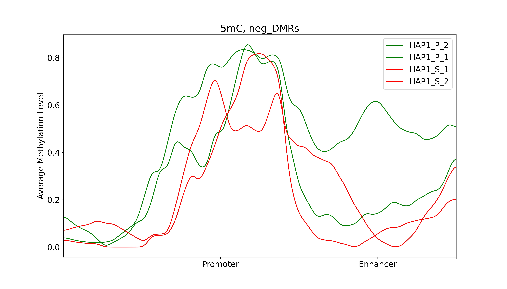
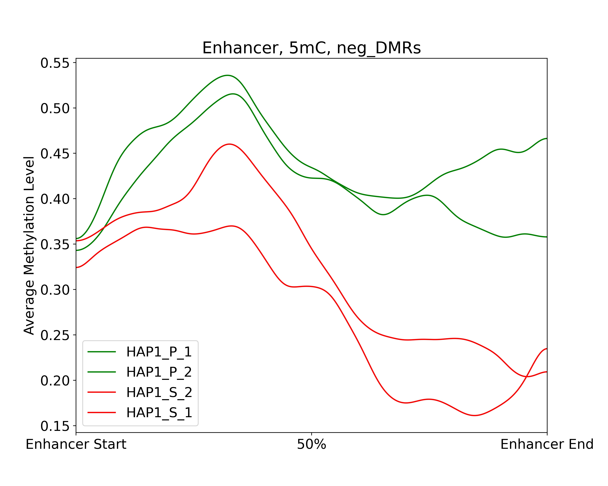

demoHAP1
========
Demo for hap1 cells is provided with the package. There are two bash scripts provided inside the demo/demo2_hap1_cell/. First one is `run_hap1_preprocess.sh` and second is `run_hap1_cell` where run_hap1_preprocess.sh should be run first. Both are explained as  under.

Step 1: dds_analysis preprocess
_______________________________
The `dds_analysis preprocess` step prepares the input files for further analysis using the `dds_analysis` module. It requires specifying various parameters and input file paths. Here is the code:

.. code-block:: bash

   # Before running following steps, it assumes that DMRs are already predicted by dmr_analysis

   dds_analysis preprocess \
         -in_folder ../../data/hap1_cell/in_data/final_demo_data/hap1_cell/out_data/DMR_CpG_context/out_map2genome/ \
         -in_string '_hap1' \
         -in_tss_file_mr ../../data/hap1_cell/in_data/final_demo_data/hap1_cell/out_data/DMR_CpG_context/out_map2genome/3_chroms_all_mr_data_range_dmrRanking_TSS_Up5000_Down1000_removedShort_overlap1e-09.bed \
         -in_dist_file ../../data/hap1_cell/in_data/final_demo_data/hap1_cell/out_data/DMR_CpG_context/out_map2genome/3_chroms_all_mr_data_range_dmrRanking_noGenes_5dist_Up1000000_Up5000removedShort_overlap1e-09.bed \
         -in_deg_file ../../data/hap1_cell/in_data/final_demo_data/hap1_cell/in_data/DEG/HAP1_P1_vs_HAP1_KO1_differentially_expressed_genes_min1.1Fd_min1RPKM.txt \
         -out_folder ../../data/hap1_cell/out_data/ \
         -tss_file  ../../data/hap1_cell/in_data/final_demo_data/hap1_cell/out_data/DMR_CpG_context/data/TSS_Up5000_Down1000_removedShort.bed \
         -full_mr_file ../../data/hap1_cell/in_data/final_demo_data/hap1_cell/out_data/DMR_CpG_context/3_chroms_all_mr_data_range_dmrRanking.bed \
         -in_genome_file ../../data/hap1_cell/in_data//final_demo_data/genome/hg38/hg38_all_enhancers_merged_hglft_genome_327b3_4dmr.bed \
         -gene_col_name '#gene'

   echo "To find DMR regions that are overlapping with TSS or 5distance regions of DEG - and preprocess Done"

Here head of MR file with TSS region used as input is displayed:
3_chroms_all_mr_data_range_dmrRanking_TSS_Up5000_Down1000_removedShort_overlap1e-09.bed

.. code-block:: bash

    chr3    8500658 8506658 chr3:8500658:8506658:NR_033378||TSS:5000:1000||LMCD1-AS1:-:8221146:8501658      chr3    8462210 8501263 chr3:mr61:hypo:U        0.009313857563925538
    chr3    8500658 8506658 chr3:8500658:8506658:NR_033378||TSS:5000:1000||LMCD1-AS1:-:8221146:8501658      chr3    8502690 8519521 chr3:mr62:hypo:D        0.9473746593032959
    chr3    8496806 8502806 chr3:8496806:8502806:NM_001278234||TSS:5000:1000||LMCD1:+:8501806:8568125       chr3    8462210 8501263 chr3:mr61:hypo:U        0.009313857563925538
    chr3    8496806 8502806 chr3:8496806:8502806:NM_001278234||TSS:5000:1000||LMCD1:+:8501806:8568125       chr3    8502690 8519521 chr3:mr62:hypo:D        0.9473746593032959
    chr3    8496822 8502822 chr3:8496822:8502822:NM_001278233&NM_001278235||TSS:5000:1000||LMCD1:+:8501822:8574668&8551274  chr3    8462210 8501263 chr3:mr61:hypo:U        0.009313857563925538
    chr3    8496822 8502822 chr3:8496822:8502822:NM_001278233&NM_001278235||TSS:5000:1000||LMCD1:+:8501822:8574668&8551274  chr3    8502690 8519521 chr3:mr62:hypo:D        0.9473746593032959

While head of methylation regions file overlapped with 5 dist region is following:
3_chroms_all_mr_data_range_dmrRanking_noGenes_5dist_Up1000000_Up5000removedShort_overlap1e-09.bed

.. code-block:: bash

    chr3    7540284 8535284 chr3:7540284:8535284:NR_046606||5dist:5000:1000000||GRM7-AS1:-:7519740:7535284  chr3    8101574 8101679 chr3:mr0:mix:U  0.0020392338824331358
    chr3    7540284 8535284 chr3:7540284:8535284:NR_046606||5dist:5000:1000000||GRM7-AS1:-:7519740:7535284  chr3    8102773 8107735 chr3:mr1:mix:D  0.9863575510990631
    chr3    7540284 8535284 chr3:7540284:8535284:NR_046606||5dist:5000:1000000||GRM7-AS1:-:7519740:7535284  chr3    8119920 8125713 chr3:mr3:mix:D  0.9800274651202444
    chr3    7540284 8535284 chr3:7540284:8535284:NR_046606||5dist:5000:1000000||GRM7-AS1:-:7519740:7535284  chr3    8136677 8139855 chr3:mr4:mix:D  0.9795108977746336

Input file that consist of methylation regions is following:
3_chroms_all_mr_data_range_dmrRanking.bed

.. code-block:: bash

    chr3    8101574 8101679 chr3:mr0:mix:U  0.0020392338824331358
    chr3    8102773 8107735 chr3:mr1:mix:D  0.9863575510990631
    chr3    8108750 8115603 chr3:mr2:mix:D  0.9763066966833287
    chr3    8119920 8125713 chr3:mr3:mix:D  0.9800274651202444
    chr3    8136677 8139855 chr3:mr4:mix:D  0.9795108977746336

Differentially expression file is below:
HAP1_P1_vs_HAP1_KO1_differentially_expressed_genes_min1.1Fd_min1RPKM.txt

.. code-block:: bash

    AADAT   0.006070520526336222    16.90556267502578       15.3097562941675        16.90556267502578       13.389386678473848      12.573766472283713      11.850516581141726
    AARS    0.0006937443220722942   58.2440643381434        58.810394758261374      59.96440144545457       33.27901746502996       32.504309785698375      29.03704380096956
    AATK    0.02271698518484375     2.5554957565029683      2.643258236240186       2.0719454919445686      3.1558313097737094      3.4185648937579978      3.93619336697585
    ABAT    1.9842909957276316e-05  0.36312747169342474     0.4141701884134888      0.4404845359100948      1.1351009276855188      1.1024911071781391      1.1728150315920693
    ABCA1   0.013656558666489764    3.074263544209392       2.5879886642784986      2.4299433764226444      1.6758838422325957      1.4414555073263386      1.3930064239495081

Set paths:
----------

.. code-block:: bash

    #main path of input data
    IN_DATA_PATH='../../data/hap1_cell/in_data/final_demo_data/hap1_cell/'

    #path of DMR results from dmr_analysis
    IN_MR_PATH=${IN_DATA_PATH}'/out_data/DMR_CpG_context/'

    #path of DEG results from bpb3
    IN_DEG_PATH=${IN_DATA_PATH}'/in_data/DEG/'

    #DEG file name from bpb3 differential_analysis, the original DEF file from bpb3 that was used to convert Zscores in dds_analysis preprocess
    IN_DEG_FILE='HAP1_P1_vs_HAP1_KO1_differentially_expressed_genes_min0Fd_min0RPKM.txt '
    in_data_str='_hap1'

    #path to output data
    OUT_PATH='../../data/hap1_cell/out_data/'

    #path to exported MRs that are not located in TSS or enhancer regions
    FILE_FOLD=${OUT_PATH}/out4mr_not_in_tss_enhancer
    #file name for background sample list that contain all MRs not located in TSS or enhancers
    BACK_FILE=${OUT_PATH}/background_samples_list.tsv

    #whether to skip below two steps in the pipeline
    is_run_dmr_export=1 # 1 for exporting, other values for skipping this step
    is_run_dtarget=1    # 1 for run dTarget prediction , other values for skipping this step

Step 2: DMR data export
_______________________
The DMR data export step involves exporting DMR data that is either located in TSS or 5'distance regions. It uses the `dmr_exportData` command from the `dmr_analysis` module. Here is the code:

.. code-block:: bash

   # Before running this step, ensure DMRs are already predicted by dmr_analysis

   dmr_analysis dmr_exportData \
         --input_mr_data_folder ${IN_MR_PATH} \
         --output_file_folder ${OUT_PATH}/out4dmr_in_deg_tss_5dist \
         --input_file_format 0 \
         --number_of_processes 10 --input_file ${OUT_PATH}/uqdmr_regions_in_deg_tss_5dist${in_data_str}.bed -wtStr 'HAP1_P_'

   echo "Export data of DMRs overlapping to TSS or 5distance - Done"

.. code-block:: bash

    chr13	95217448	95424140	chr13:mr8:hypo:D	chr13:95300446:95306446:NM_005845||TSS:5000:1000||ABCC4:-:95019828:95301446;chr13:95300451:95306451:NM_001301829&NM_001105515||TSS:5000:1000||ABCC4:-:95019834&95095770:95301451
    chr3	9055959	9261176	chr3:mr88:mix:D	chr3:9248646:9254646:NM_014850||TSS:5000:1000||SRGAP3:-:8980590:9249646

   # Export data of MRs not in TSS or enhancers
   dmr_analysis dmr_exportData  \
         --input_mr_data_folder ${IN_MR_PATH} \
         --output_file_folder ${OUT_PATH}/out4background \
         --input_file_format 0 \
         --number_of_processes 10 --input_file ${OUT_PATH}/uqdmr_regions_not_in_deg_tss_5dist${in_data_str}.bed -wtStr 'HAP1_P_'

   echo "Export data of MRs not in TSS or enhancers - Done"

Step 3: Background file list creation
_____________________________________
The background file list creation step involves creating a background file list if it doesn't already exist. The background file list contains all MRs that are not located in TSS or enhancer regions. Here is the code:

.. code-block:: bash

   background_filelist="${OUT_PATH}/backgroundFileList.txt"

   if [[ ! -f "$background_filelist" ]]; then
       cd ${OUT_PATH}/out4background
       ls | grep ".bed" > $background_filelist
       cd -
       echo "Creating a list of background files - Done"
   else
       echo "Background file list already exists."
   fi

   echo "Background file list creation - Done"

Step 4: DEG File preparation:
_____________________________

Prepare a tab delimited gene expression file in which the group mean values and rratio are added.
This file will be used to plot average methylation levels of selected gene in TSS and Enhancer regions
After inputting a DEG file  exported by bpb3 differential_expression, it exports a tab delimited file by adding three columns values of the group mean and rratio.
This filtered DEG file will only be used in plot_tss_enhancer_mrs for exporting data
This function only consider input data as RPKM values

.. code-block:: bash

    gene_mr_file=${OUT_PATH}/uqGeneDmr_regions_in_deg_tss${in_data_str}.bed

    dds_analysis filterDEG4bpb3 --in_group1_str 'HAP1_P1' --in_group2_str 'HAP1_KO1' \
            --in_folder ${IN_DEG_PATH} \
            --in_file ${IN_DEG_FILE} \
            --min_median_RPKM 0 --rr_cutoff 0.0

    #we can skip this manual input step if know the input gene expression file name
    if [ 1 == 2 ];
    then
    read -p "To continue please copy the exported zscore cluster file name and path from bpb3 filterDEG4bpb3 then click return: " gene_exp_file

    echo "gene_exp_file is :  $gene_exp_file "
    read -p "To continue please copy the exported group mean file name and path from bpb3 filterDEG4bpb3 then click return: " IN_DEG_FILE

    echo "IN_DEG_FILE is :  $IN_DEG_FILE "

    fi
    #end test

We assume know the input gene exp file name gene_exp_file0=${IN_DEG_PATH}/${IN_DEG_FILE}
Here we assume file name end with .txt

.. code-block:: bash

    finds='.txt'
    replace1='_rratio_filtered4cluster.csv'
    replace2='_rratio_filtered.csv'
    gene_exp_file=${gene_exp_file0//$finds/$replace1}
    IN_DEG_FILE=${gene_exp_file0//$finds/$replace2}
    echo ""
    echo "gene_exp_file is :  $gene_exp_file "
    echo ""
    echo "IN_DEG_FILE is :  $IN_DEG_FILE "
    echo ""

    # path of DMRs associated with DEG, TSS and 5distance, prepared by run dds_analysis preprocess
    in_mr_data_folder=${OUT_PATH}/out4dmr_in_deg_tss_5dist
    # a file for a list of background samples
    in_background_mr_file=$BACK_FILE
    #number of random sampling for the test
    number_of_samples=10

HAP1_P1_vs_HAP1_KO1_differentially_expressed_genes_min1.1Fd_min1RPKM_rratio_filtered4cluster.txt head is following:

.. code-block:: bash

    FAM166AP3	-0.4982081983511595	-0.9394358401186298	-0.6707136220439952	-1.7706649617423529	-1.7471009146010719	-1.759213053860002
    RP11-561I11.3	-0.7538360859791011	-0.8163195171038196	-1.0486517498078607	-1.7688207617054021	-1.745213065641895	-1.7573721462587126
    AC009299.4	-1.240842456343193	-0.9978063637216715	-0.8863905055414616	-1.7671318296845058	-1.743530972980885	-1.7556519670664428
    FAM41C	-1.1073411320948858	-1.332098180960522	-1.106948209449783	-1.7284061127409744	-1.7596852452138803	-1.7717564601163207
    ARSE	-0.8784524519818689	-1.0690546795243978	-0.8785276236434105	-1.7487097864101793	-1.7626589252195035	-1.639011789153589
    RP11-442H21.2	0.05741831209072534	-0.13825346076745668	-0.22036980044826926	-1.3796771543980877	-1.529168641624075	-1.7594854289267512
    RP11-422P24.12	-1.096537825707665	-1.0424048390869258	-1.282182441903589	-1.7668478469733657	-1.7432581180749236	-1.6746361853756075
    RP4-590F24.2	-1.1047323074565782	-1.228979590661412	-1.1307512157539712	-1.676088854525317	-1.760365854510401	-1.755233404634837
    MIR4419A	-0.16271440608073698	-0.16705481613532722	-0.49940830855525836	-1.582622407034913	-1.545955456168695	-1.5599446568981838
    INHBE	0.4194153086557727	0.37903743335847656	0.4158868327542566	-1.3577006540490815	-1.153783055168014	-1.4861394387459987
    CHAC1	2.3416693314259813	2.3286405094448774	2.3462661518248256	0.2075086031948541	0.21713102593121023	0.05283409591964295

Step 5: dTarget Prediction based in expression profiles:
________________________________________________________

The dTarget prediction step predicts putative target genes for DMRs based on gene expression profiles. It performs the prediction separately for DMRs associated with TSS regions and 5'distance regions. Here is the code:

.. code-block:: bash

   # Predict target genes for DMRs overlapping with TSS regions
   dds_analysis dTarget_methy_vs_express -inGeneMRfile $gene_mr_file  -mrTAB  \
	-inGeneEXPfile $gene_exp_file -expTAB \
	-inMRfolder $in_mr_data_folder -outName 'tss_region_' \
	-output_path $OUT_PATH -sampleName sample_name4replace.tsv \
	-pathDepth 1 -inBackgroundList $in_background_mr_file -reg_cutoff 0.5 -cutoff 1.0 -totalSamples $number_of_samples -numOfprocesses 10

    echo "Done with TSS target gene prediction"

    echo "Target gene prediction for DMRs overlapping with TSS regions - Done"

   # Predict target genes for DMRs associated with 5'distance regions

    dds_analysis dTarget_methy_vs_express -inGeneMRfile $gene_mr_file -mrTAB  \
	-inGeneEXPfile $gene_exp_file -expTAB \
	-inMRfolder $in_mr_data_folder -outName 'distance_region_'  \
	 -output_path $OUT_PATH -sampleName sample_name4replace.tsv \
	-pathDepth 1 -inBackgroundList $in_background_mr_file -reg_cutoff 0.5 -cutoff 1.0 -totalSamples $number_of_samples -numOfprocesses 10

echo "Done with 5distance region target gene prediction"

   echo "Target gene prediction for DMRs associated with 5'distance regions - Done"

Step 6: Plotting selected target gene and DMR associations
__________________________________________________________
This step involves plotting the associations between selected target genes and DMRs based on gene expression profiles. Here is the code:

.. code-block:: bash

    echo ${gene_exp_file}
    echo  ${OUT_PATH}/out4dmr_in_deg_tss_5dist
    dds_analysis plot_mr_vs_exp -inGeneEXPfile ${gene_exp_file}  \
            -dpi 300 -inMRfolder ${OUT_PATH}/out4dmr_in_deg_tss_5dist \
        -expTAB -inGene 'TRIM32' -inMR 'chr9:mr104' -wtStr 'HAP1_P' -output_path ${OUT_PATH}
    echo "Done with plot_mr_vs_exp "

Step 7: Plotting average methylation pattern
____________________________________________

The final step involves plotting the average methylation in TSS and enhancer regions for selected target gene. Here is the code:

.. code-block:: bash

    dds_analysis plot_tss_enhancer_mrs \
	-exp_file $IN_DEG_FILE \
	-dmr_file ${IN_MR_PATH}/3_chroms_all_mr_data_range_dmrRanking.bed  \
	-tss_file ${OUT_PATH}/tss_region_10sampling.csv  \
	-enc_file ${OUT_PATH}/distance_region_10sampling.csv \
	-is_negative 1 -genes 'MRPS25,PLCL2,TRIM32' -mr_folder ${OUT_PATH}/out4dmr_in_deg_tss_5dist/ \
	-folder_name '' --dmr_file_not_compressed \
	-gX 2000 -gY 1000 -wtStr 'HAP1_P_' \
	-out_folder ${OUT_PATH}/plot_tss_enhancer_mrs

    echo "Done with plot_tss_enhancer_mrs"

