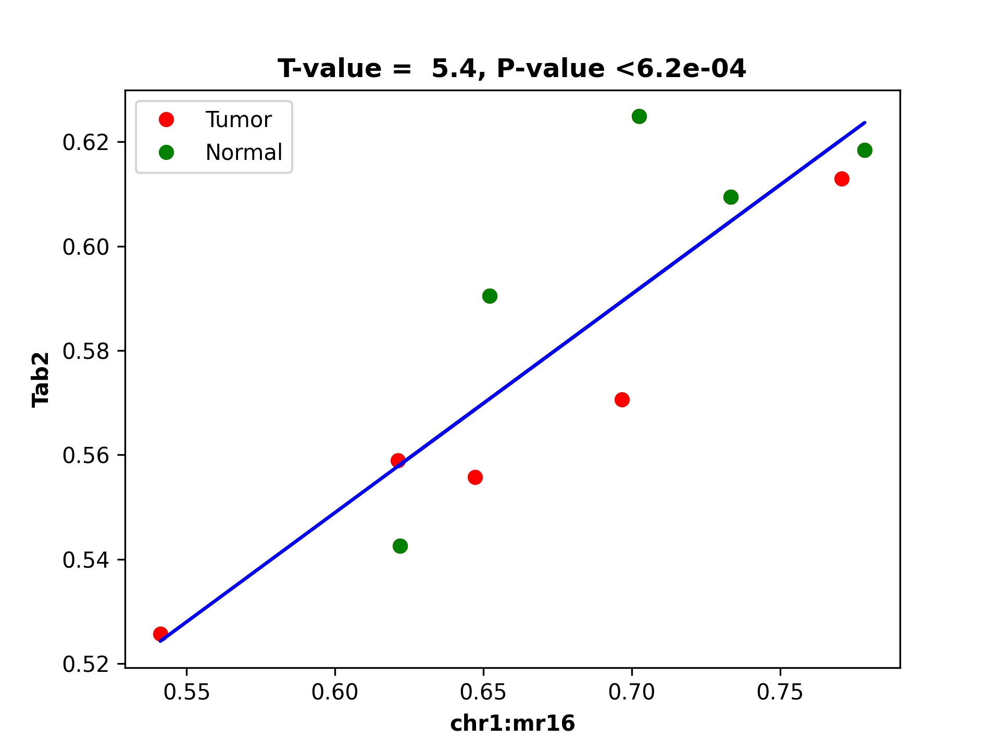

demoRAT
=======
Demo for RAT is provided with the package. There are two bash scripts provided inside the demo/demo3_rat/. First one is `run_rat_preprocess.sh` and second is `run_rat.sh` where run_rat_preprocess.sh should be run first. Both are explained as  under.

Step 1: Preparing files for dds_analysis
________________________________________

The first step involves preparing files for `dds_analysis` by running the `preprocess` command. This command integrates DMR and DEG data and prepares the necessary input files for further analysis. Here is the code:

.. code-block:: bash

   dds_analysis preprocess \
         -in_folder ../../data/rat_data/in_data/final_demo_data/rat_data/out_data/DMR_CpG_context/out_map2genome/ \
         -in_string '_rat' \
         -in_tss_file_mr ../../data/rat_data/in_data/final_demo_data/rat_data/out_data/DMR_CpG_context/out_map2genome/5_chroms_all_mr_data_range_dmrRanking_TSS_Up5000_Down1000_removedShort_overlap1e-09.bed \
         -in_dist_file ../../data/rat_data/in_data/final_demo_data/rat_data/out_data/DMR_CpG_context/out_map2genome/5_chroms_all_mr_data_range_dmrRanking_noGenes_5dist_Up1000000_Up5000removedShort_overlap1e-09.bed\
         -in_deg_file ../../data/rat_data/in_data/final_demo_data/rat_data/in_data/DEG/Adrenal1vsAdrenal2_DEG_genes_zscores.tsv\
         -out_folder ../../data/rat_data/out_data/ \
         -tss_file ../../data/rat_data/in_data/final_demo_data/rat_data/out_data/DMR_CpG_context/data/TSS_Up5000_Down1000_removedShort.bed \
         -full_mr_file ../../data/rat_data/in_data/final_demo_data/rat_data/out_data/DMR_CpG_context/5_chroms_all_mr_data_range_dmrRanking.bed \
         -in_genome_file ../../data/rat_data/in_data//final_demo_data/genome/rn6/rn6.enhancers_all_rn5_merged_rn6liftOvered_4dmr.bed \
         -gene_col_name 'gene_name'

   echo "To find DMR regions that are overlapping with TSS or 5distance regions of DEG - and preprocess Done"

Methylation region data with TSS:
5_chroms_all_mr_data_range_dmrRanking_TSS_Up5000_Down1000_removedShort_overlap1e-09.bed

.. code-block::bash

    chr1    1697695 1703695 chr1:1697695:1703695:NM_001106217||TSS:5000:1000||Lrp11:+:1702695:1731210       chr1    1672428 1702222 chr1:mr4:hypo:D 0.6678625470204508
    chr1    1766759 1772759 chr1:1766759:1772759:NM_013073||TSS:5000:1000||Pcmt1:-:1734862:1767759  chr1    1760923 1766987 chr1:mr8:mix:U  0.006477070362979133
    chr1    1766759 1772759 chr1:1766759:1772759:NM_013073||TSS:5000:1000||Pcmt1:-:1734862:1767759  chr1    1769897 1783790 chr1:mr9:mix:U  0.002069997927343053
    chr1    1766720 1772720 chr1:1766720:1772720:NM_001128191||TSS:5000:1000||Nup43:+:1771720:1781554       chr1    1760923 1766987 chr1:mr8:mix:U  0.006477070362979133
    chr1    1766720 1772720 chr1:1766720:1772720:NM_001128191||TSS:5000:1000||Nup43:+:1771720:1781554       chr1    1769897 1783790 chr1:mr9:mix:U  0.002069997927343053
    chr1    1779077 1785077 chr1:1779077:1785077:NM_001134543||TSS:5000:1000||Lats1:+:1784077:1817310       chr1    1769897 1783790 chr1:mr9:mix:U  0.002069997927343053

5_chroms_all_mr_data_range_dmrRanking_noGenes_5dist_Up1000000_Up5000removedShort_overlap1e-09.bed

.. code-block::bash
     chr1    760645  1755645 chr1:760645:1755645:NM_001099459||5dist:5000:1000000||Vom2r6:-:744615:755645    chr1    1606237 1607593 chr1:mr0:hyper:D        0.9922001543476859
    chr1    760645  1755645 chr1:760645:1755645:NM_001099459||5dist:5000:1000000||Vom2r6:-:744615:755645    chr1    1608763 1614639 chr1:mr1:hypo:D 0.6957408652288558
    chr1    760645  1755645 chr1:760645:1755645:NM_001099459||5dist:5000:1000000||Vom2r6:-:744615:755645    chr1    1616202 1632163 chr1:mr2:mix:U  0.002962664792698039
    chr1    760645  1755645 chr1:760645:1755645:NM_001099459||5dist:5000:1000000||Vom2r6:-:744615:755645    chr1    1633282 1670344 chr1:mr3:mix:U  0.5354765760385694
    chr1    760645  1755645 chr1:760645:1755645:NM_001099459||5dist:5000:1000000||Vom2r6:-:744615:755645    chr1    1672428 1702222 chr1:mr4:hypo:D 0.6678625470204508

First two columns of DEG file:
Adrenal1vsAdrenal2_DEG_genes_zscores.tsv

.. code-block:: bash

    gene_name       A_1_    A_2_    A_3_    A_4_    A_5_    A_6_    A_7_    A_8_    A_9_    A_10_   A_11_   A_12_   A_13_   A_14_   A_15_   A_16_   A_17_   A_18_   A_19_   A_20_
    Arid1a  0.7561530862764123      0.7823439770635116      0.758952508244845       0.7698258391396798      0.7497426117338984      0.769720948287346       0.732882230955056       0.7296251043089049      0.7514965201895426      0.7338532863506189      0.7886223599117105      0.8529983070846237      0.7885741576782851      0.8218302605645192      0.8091759613067595      0.8418558180210152      0.8557029309669116      0.8693442751832348      0.845426060550429       0.8252216195608033
    Thrap3  0.9440078946411076      0.9447565791934174      0.9617047828634032      0.9798829216418276      0.9845821803378495      1.0257580329373464      0.9429194156914074      1.0212971018858565      0.9475315367780314      0.9980933740996731      1.0788865992755503      1.0205072299517544      1.0017010542203388      1.1051539689926302      1.0494474332333024      1.0576674827137567      1.0449053416313256      1.100779331162259       1.089149536395491       1.0448197466318785

Head of Full MR data:
5_chroms_all_mr_data_range_dmrRanking.bed

.. code-block:: bash

    chr1    1606237 1607593 chr1:mr0:hyper:D        0.9922001543476859
    chr1    1608763 1614639 chr1:mr1:hypo:D 0.6957408652288558
    chr1    1616202 1632163 chr1:mr2:mix:U  0.002962664792698039
    chr1    1633282 1670344 chr1:mr3:mix:U  0.5354765760385694
    chr1    1672428 1702222 chr1:mr4:hypo:D 0.6678625470204508
    chr1    1703720 1752087 chr1:mr5:hypo:D 0.5689430990479308
    chr1    1753230 1757707 chr1:mr6:mix:D  0.9692464930654068
    chr1    1759129 1759849 chr1:mr7:hypo:U 0.015063164586032518

Step 2: Export data:
____________________

The second step involves running the `dmr_analysis dmr_exportData` command to export relevant methylation region data.

Defining input/output paths

.. code-block:: bash

   IN_DATA_PATH='../../data/rat_data/in_data/final_demo_data/rat_data/'
   IN_MR_PATH=${IN_DATA_PATH}'/out_data/DMR_CpG_context/'
   IN_DEG_PATH=${IN_DATA_PATH}'/in_data/DEG/'

   # Define output path
   OUT_PATH='../../data/rat_data/out_data/'

   # Define file paths
   FILE_FOLD=${OUT_PATH}/out4mr_not_in_tss_enhancer
   BACK_FILE=${OUT_PATH}/background_samples_list.tsv

   # Set variables
   in_data_str='_rat'
   is_run_dmr_export=1
   is_run_dtarget=1

Export data for DMRs overlapping with TSS or 5'distance regions

.. code-block:: bash

   if [ $is_run_dmr_export == 1 ]; then
      dmr_analysis dmr_exportData \
            --input_mr_data_folder ${IN_MR_PATH} \
            --output_file_folder ${OUT_PATH}/out4dmr_in_deg_tss_5dist \
            --input_file_format 0 \
            --number_of_processes 10 --input_file ${OUT_PATH}'/uqdmr_regions_in_deg_tss_5dist'${in_data_str}'.bed' -wtStr '_Ctrl'
      echo "Export data of DMRs overlapping to TSS or 5distance - Done "
      echo ""

Export data for MRs that are not in TSS or enhancer regions

.. code-block:: bash

      dmr_analysis dmr_exportData  \
            --input_mr_data_folder ${IN_MR_PATH} \
            --output_file_folder ${OUT_PATH}/out4mr_not_in_tss_enhancer \
            --input_file_format 0 \
            --number_of_processes 10 --input_file ${OUT_PATH}'/mr_regions_not_in_enhancers'${in_data_str}'_tss.bed' -wtStr '_Ctrl'
      echo "Export data of MRs not in TSS or enhancers - Done "
   fi

Output of above export file is :

.. code-block:: bash

    chr1	1606237	1607593	chr1:mr0:hyper:D	0.9922011104993337
    chr1	1608763	1614639	chr1:mr1:hypo:D	0.6973919073178528
    chr1	1616202	1632163	chr1:mr2:mix:U	0.002969192663881476
    chr1	1753230	1757707	chr1:mr6:mix:D	0.9680422087690608
    chr1	1759129	1759849	chr1:mr7:hypo:U	0.01498598083737056
    chr1	2046752	2046955	chr1:mr14:mix:U	0.0014361082628083287
    chr1	2066186	2066327	chr1:mr15:hypo:D	0.9992651107122464
    chr1	2238597	2239647	chr1:mr21:mix:U	0.010873500659218552

Create background file list if it does not exist

.. code-block:: bash

   if ! [ -f $BACK_FILE ]; then
      echo $BACK_FILE " not exists and create one ! "
      if [ -e $FILE_FOLD ]; then
         ls  ./${FILE_FOLD}/chr*/data/*raw*.* > $BACK_FILE
         echo "Create " $BACK_FILE
      else
         echo "Cannot create background file because no data folder find! " $FILE_FOLD
      fi
   fi

Step 3: Running dds_analysis dTarget_methy_vs_express
_____________________________________________________

The third step involves running the `dds_analysis dTarget_methy_vs_express` command to predict putative target genes for DMRs based on their associations from either TSS or 5'distance regions. Here is the code:

.. code-block:: bash

   # Run dTarget_methy_vs_express for predicting target genes
   if [ $is_run_dtarget == 1 ]; then
      gene_mr_file=${OUT_PATH}'/uqGeneDmr_regions_in_deg_tss'${in_data_str}'.bed'
      gene_exp_file=${IN_DEG_PATH}'/Adrenal1vsAdrenal2_DEG_genes_zscores.tsv'
      in_mr_data_folder=${OUT_PATH}/out4dmr_in_deg_tss_5dist
      in_background_mr_file=$BACK_FILE
      number_of_samples=10

      # Test target gene and DMR associations from TSS regions

        dds_analysis dTarget_methy_vs_express -inGeneMRfile $gene_mr_file  -mrTAB \
            -inGeneEXPfile $gene_exp_file -expTAB \
            -inMRfolder $in_mr_data_folder -outName 'tss_region_' \
            -output_path $OUT_PATH -sampleName 'sample_name4replace.tsv' \
            -pathDepth 1 -inBackgroundList $in_background_mr_file -cutoff 0.05 -totalSamples $number_of_samples -numOfprocesses 10

      echo "Done with TSS target gene prediction"

      # Test target gene and DMR associations from 5'distance regions
      gene_mr_file=${OUT_PATH}'/uqGeneDmr_regions_in_deg_5dist'${in_data_str}'_overlap_enhancer.bed'

      dds_analysis dTarget_methy_vs_express -inGeneMRfile $gene_mr_file -mrTAB \
            -inGeneEXPfile $gene_exp_file -expTAB \
            -inMRfolder $in_mr_data_folder -outName 'distance_region_'  \
            -output_path $OUT_PATH -sampleName 'sample_name4replace.tsv' \
            -pathDepth 1 -inBackgroundList $in_background_mr_file -cutoff 0.01 -totalSamples $number_of_samples -numOfprocesses 10

      echo "Done with 5'distance target gene prediction"
   fi

Step 4: Plotting selected target gene and DMR associations
__________________________________________________________

.. code-block:: bash

    gene_exp_file=${IN_DEG_PATH}'/Adrenal1vsAdrenal2_DEG_genes_zscores.tsv'
    OUT_PATH='../../data/rat_data/out_data/'

    dds_analysis plot_mr_vs_exp -inGeneEXPfile ${gene_exp_file}  \
          -dpi 300 -inMRfolder ${OUT_PATH}/out4dmr_in_deg_tss_5dist \
          -sampleName sample_name4replace.tsv -expTAB -inGene 'Tab2' -inMR 'chr1:mr16' -wtStr '_Ctrl' -output_path ${OUT_PATH}

The output for the above command where we plot chromosome 1 methylation region 16 is following:

